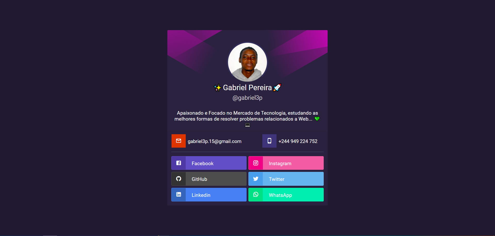

<p align="center">
  
</p>
<h1 style="margin-top: -15px; text-align: center; font-size: 3.5rem">
    My Site
</h1>


## 🧪 Tecnológias

Este app foi desenvolvido utilizando as seguintes tecnologias:

- [TypeScript]([https://](https://www.typescriptlang.org/)
- [Next.js](https://nextjs.org)
- [React.js](https://https://reactjs.org/)
- [Styled Components](https://styled-components.com/)
- [Bootstrap](https://getbootstrap.com/)

## 🚀 Começando

Clone o projeto e acesse a pasta.

```bash
$ git clone https://github.com/gabriel3p/my_site
$ cd my_site
```

Siga os passos abaixo:

```bash
# Instale as dependências
$ yarn

# Inicie o projeto
$ yarn dev
```

